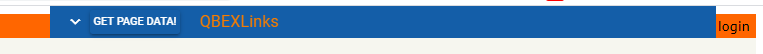
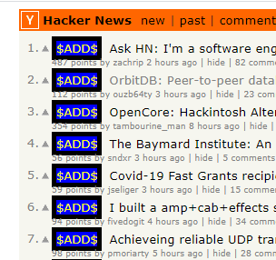
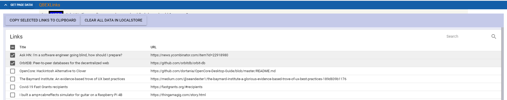

# QBEXLinks example (qbexlinks)

Example of BEX technology in Quasar

## Install the dependencies
```bash
npm install
```

### Start the app in development mode (hot-code reloading, error reporting, etc.)
```bash
quasar dev -m bex
```

Follow the development procedure for chrome and firefox described here:
[https://quasar.dev/quasar-cli/developing-browser-extensions/build-commands](https://quasar.dev/quasar-cli/developing-browser-extensions/build-commands)

### Build the app for production
```bash
quasar build -m bex
```

Follow the production building tutorial here:
[https://quasar.dev/quasar-cli/developing-browser-extensions/build-commands#Building-for-Production](https://quasar.dev/quasar-cli/developing-browser-extensions/build-commands#Building-for-Production)

## What works as of now

Currently it works in Chrome (only). After installation you need to browse to [https://news.ycombinator.com/](https://news.ycombinator.com/). This extension works only with this site.

- The blue bar will be placed near top of the page. The main idea is to retrieve some data from page, interact with page in both ways and make some privileged actions from the context of the extension.

- before every link in hackernews page there will be added clickable element

- clicking on this element will add link to the extension db with checked state
- clicking on the "Get page data!" bar button will add all the links on the page, but without checked state
- clicking on the arrow icon on the bar will toggle the list of links

- on the toolbar there is a button with privileged operation - copy to clipboard all selected links
- on the toolbar there is a button which clears all retrieved data
- the state of the links is stored to browsers localstorage (in the context of the extension)

## To do
- [ ] why this doesn't work in Firefox?
- [ ] implement something with dom-hooks - ideas?
- [ ] implement something with background-hooks - ideas?
- [ ] implement popup page
- [ ] implement options page
- [ ] implement devtools page
- [ ] implement sidebar page - works in Firefox
- [ ] implement axios communication with backend
- [ ] check all possible manifest.json options
